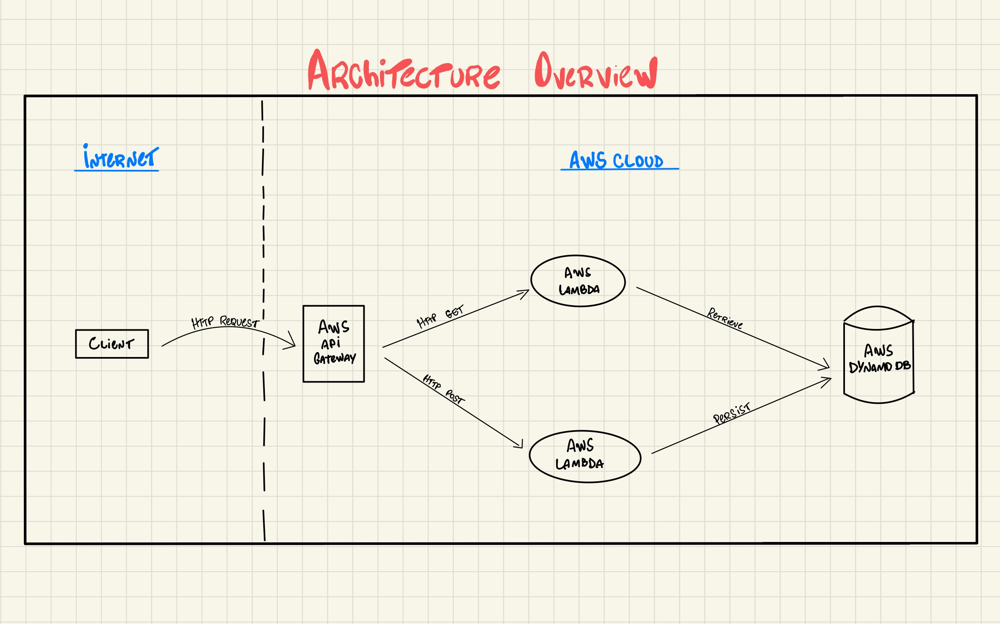

# Projeto de Conclusão da Disciplina de Serverless - FIAP

## Contexto

Criação de duas Lambda functions na AWS que interagem com um banco de dados DynamoDB para buscar e criar novos produtos.

## Utilização

### Endpoints

- GET Produtos
```
https://ygk96o66n8.execute-api.us-east-1.amazonaws.com/products
```

- POST Produtos
```
https://ygk96o66n8.execute-api.us-east-1.amazonaws.com/products

{
    "nome": "Galaxy S22",
    "valor": 3500.50
}
```


### Postman

Na pasta `postman`, na raiz do projeto, está a collection para ser importada localmente.

## Arquitetura


